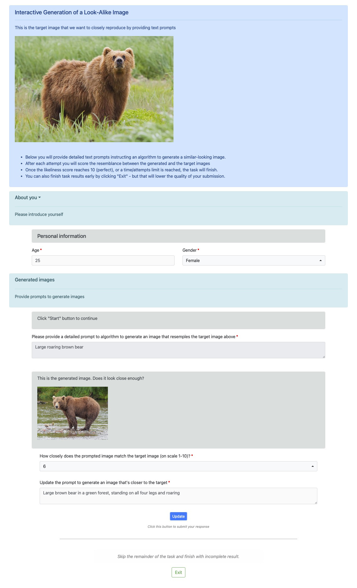

---
# Copyright (c) Meta Platforms and its affiliates.
# This source code is licensed under the MIT license found in the
# LICENSE file in the root directory of this source tree.

sidebar_position: 7
---

# Run model-in-the-loop tasks

Mephisto allows to create interactive Tasks where worker can interact with the server during completion of their Task.


-----


## Interactive Image Generation Task

A good example Task demonstrating this is "Interactive Generation of a Look-Alike Image"


#### Task Flow

At a high level, here's what this Task entails:

- Worker's goal is to compose a Generative AI text prompt to produce an image that closely resembles initially displayed "target" image
- Worker is given up to `max_answer_loops` attempts to achieve the goal
    - Each attempt consists of judging the generated image (with the resemblance `score`), and updating the text prompt
        - Worker cannot reuse exactly the same text prompt from any of the previous attempts
    - Goal is reached if worker indicates `score=10` in their response (perfect resemblance is achieved)
- After receiving each attempt, based on the updated text prompt the server produces a new image and extra instruction
    - Here we're picking a random locally stored image, but this could also be a request to a 3rd party API
    - Extra instruction shown to worker will vary, depending on provided score


#### Technical Notes

Some technical aspects are worth pointing out, to understand this example better:

- This Task is based on our [FormComposer feature](/docs/guides/tutorials/form_composer/) since worker input is form-based
- We make use of [custom triggers](/docs/guides/how_to_use/form_composer/configuration/insertions/#js-trigger-insertion)
to send server requests invoking server-side (called "remote") procedures

We recommend examining [source code](https://github.com/facebookresearch/Mephisto/blob/main/examples/remote_procedure/interactive_image_generation) for a deeper look, in particular:

- [run_task__local__inhouse.py](https://github.com/facebookresearch/Mephisto/blob/main/examples/remote_procedure/interactive_image_generation/run_task__local__inhouse.py) -
see how task is being prepared and the logic of remote procedure (that simulates the image generation part)
- [data](https://github.com/facebookresearch/Mephisto/blob/main/examples/remote_procedure/interactive_image_generation/data/) -
see FormComposer config used for this Task
- [custom_triggers.js](https://github.com/facebookresearch/Mephisto/blob/main/examples/remote_procedure/interactive_image_generation/data/insertions/custom_triggers.js) -
see the UI logic behind clicking "Start" and "Update" buttons in the form:
    - preparing request data
    - sending server request
    - processing server response
    - updating form's React state


#### Run with Docker

To launch this example from within a Docker container follow these steps:

1. (Optional) You can modify, then prepare and validate your config files as described in [FormComposer config files](/docs/guides/how_to_use/form_composer/configuration/setup/) and
[form_composer config command](/docs/guides/how_to_use/form_composer/configuration/form_composer_config_command/) sections

2. Launch the example for a local testing scenario:

```shell
docker-compose -f docker/docker-compose.dev.yml run \
    --build \
    --publish 8081:8000 \
    --publish 3001:3000 \
    --rm mephisto_dc \
    python /mephisto/examples/remote_procedure/interactive_image_generation/run_task__local__inhouse.py
```

3. Once your Task launches, your console will display you Task Unit URLs like this: `http://localhost:3001?worker_id=WORKER_USERNAME&id=1`

4. Opening a Task Unit URL will show you a page like this:



#### Further Details

You can learn more in these sections:
- [Run form-based tasks](/docs/guides/tutorials/form_composer/)
- [FormComposer overview](/docs/guides/how_to_use/form_composer/overview/)
- [Run FormComposer tasks](/docs/guides/how_to_use/form_composer/running/)
- [JS trigger insertion](/docs/guides/how_to_use/form_composer/configuration/insertions/#js-trigger-insertion)
